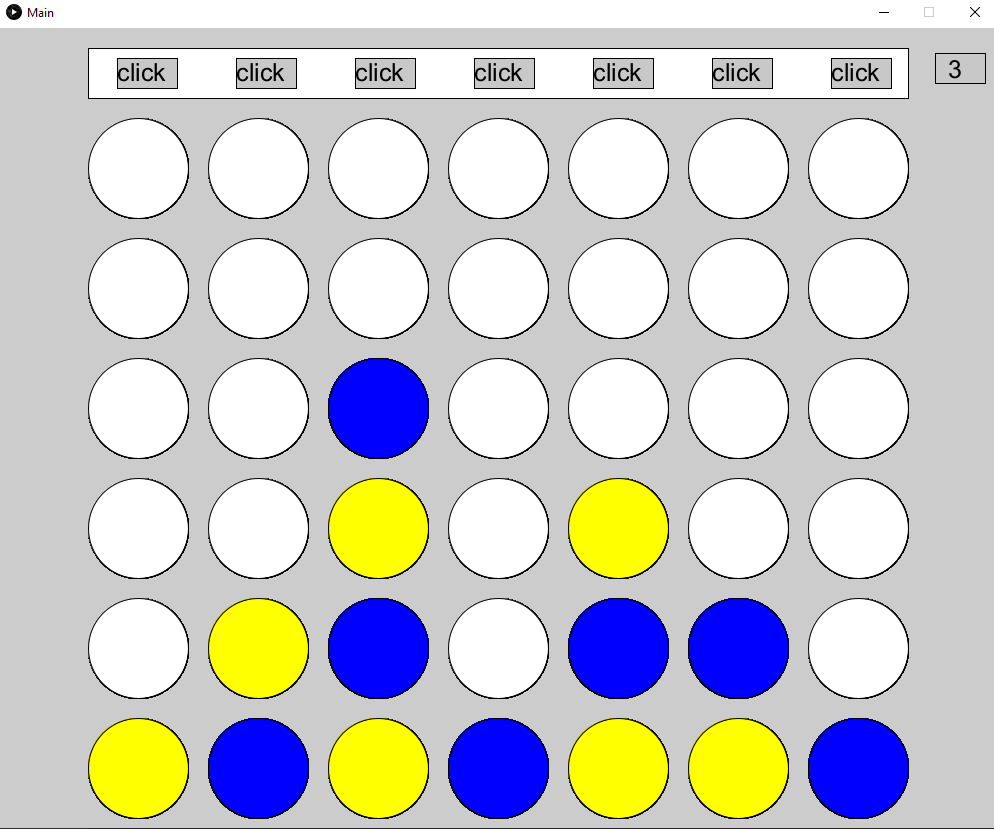

# Kurzbezeichnung für Ihr Spiel, Ihre Simulation oder Animation (PiS, SoSe 2021)

Autor: Murat Algül, 5273683

## Kurzbeschreibung (50-150 Wörter)
Bei meinem Projekt handelt es sich um das 2-Spieler Spiel 4 Gewinnt. In dem Spiel müssen die Spieler versuchen 4 gleichfarbige Steine nebeneinander zu setzten.
Es ist egal, ob dies diagonal, horizontal oder waagerecht erfolgt. Jeder Spieler hat genau 5 Sekunden Zeit ein Stein zu setzen.
Also haben die Spieler ein wenig Zeitdruck, was alles nochmal spannender macht. Wenn die Spieler innerhalb von 5 Sekunden kein
Stein gelegt haben, wird ein zufälliger Stein geworfen und der zweite Spieler ist dran. Es geht so weiter im Wechsel bis einer gewinnt.(89 Wörter)

## Screenshot

## Bedienungshinweise

Mein Spiel wird mit der linken Maustaste überwiegend gespielt. Oben sind Click Flächen zu sehen.
Man muss mit der linken Maus Taste draufklicken um ein Stein zu setzten. Wenn einer gewinnt oder es unentschieden ist, 
erscheint ein Fenster wo man entscheiden kann, ob man weiter spielen möchte oder das Spiel beenden möchte.
Mit der Taste `R` spielt man ein weiteres Spiel und mit der Taste `E` beendet man das Spiel.

## Dateiübersicht und Lines of Code

    \README.md
    \Screenshot.png
    \app\build.gradle
    \app\core.jar
    \app\src\main\java\Pis_hue1_\Game.java
    \app\src\main\java\Pis_hue1_\GameEngine.java
    \app\src\main\java\Pis_hue1_\Main.java
    \app\src\test\java\Pis_hue1_\AppTest.java

    -------------------------------------------------------------------------------
    Language                     files          blank        comment           code
    -------------------------------------------------------------------------------
    Java                             3             77             38            250
    -------------------------------------------------------------------------------
    SUM:                             3             77             38            250
    -------------------------------------------------------------------------------

## Verwendete Quellen

* Java der Grundkurs - Michael Kofler
* Grundkurs Programmieren in JAVA - Dietmar Ratz, Dennis Schulmeister-Zimolong, Detlef Seese, Jan Wiesenberger
* https://moodle.thm.de/pluginfile.php/322202/mod_resource/content/4/01_loops.html (Abruf,23.6.2021)
* https://drive.google.com/file/d/1i_ESgfff8VmCQk7kN8QFopR5Yqxi7fa_/view (Abruf,21.6.2021)
* https://moodle.thm.de/pluginfile.php/782932/mod_resource/content/1/Datenstrukturen_U%CC%88bung.pdf (Abruf,10.6.2021)
* https://www.youtube.com/watch?v=Nu5lZ3oxl9s&list=PLNmsVeXQZj7oirQMpjPjrmNx4vcVIGIGY&index=48 (Abruf,21.6.2021)
* https://www.youtube.com/watch?v=we3zJE3hlWE&t=68s (Abruf,29.6.2021)
